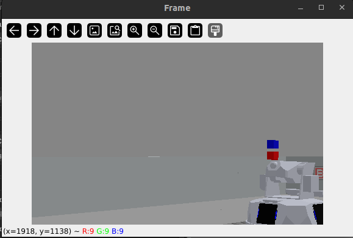
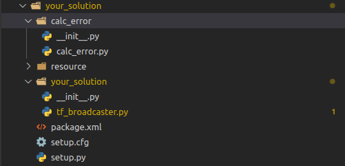
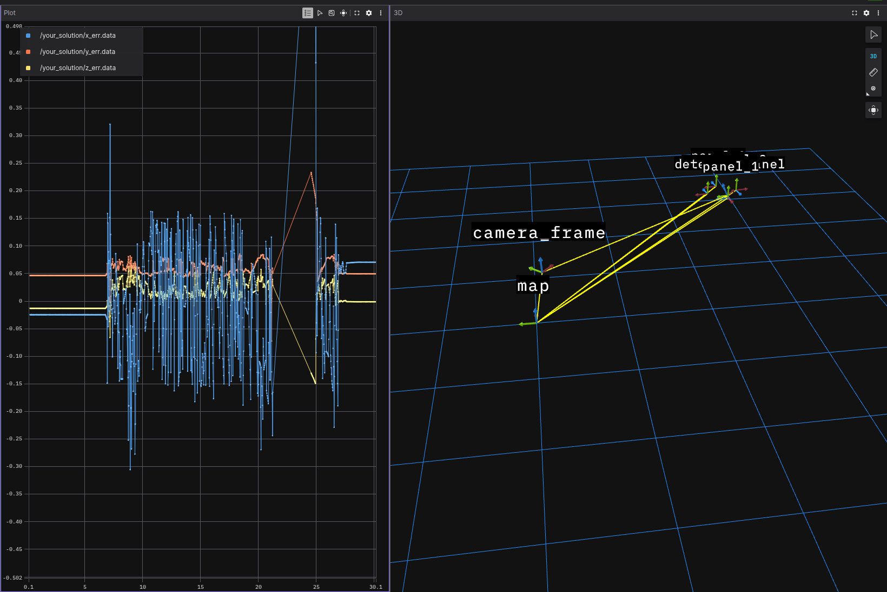

# tr-autonomy-training-visualization

## Introduction

In this training you will create visualizations and logging to determine the accuracy of the HuskyBot cv stack in a simulated environment.
You will use foxglove to easily visualize what is happening. Your end result might look something like the video below

[output.webm](https://github.com/user-attachments/assets/1d7bc3bb-b839-484e-9fd0-1a842f532db3)

__in order to complete this assignment please ask the Autonomy lead to invite you to the Foxglove studio organization__

## Learning objectives

- understand the importance for good visualizations and logging in the debugging and performance analysis process
- create and incorprate a new package from scartch into a existing workspace
- work in an environment that is closer to the real TR autonomy stack, not just a isolated training workspace
- learn how to work with complex, nested msg interfaces and custom msg interfaces
- learn how to use the tf2 library
- introduction to the TR robot simulator  
- learn how to use rclpy and other python ros2 packages
- reinforce core ros2 skills

## Getting oriented

TODO FIXME talk about the submodules here

1. clone this repository
2. run `git submodule update --init` in the root dir of this repo
3. your workspace should look similar to the following. Make sure the submodule directories are not empty and are initialized with files

4. run `colcon build`
5. run each of the following commands __IN THEIR OWN terminal__ (you can have one terminal window and use multiple tabs, or create multiple terminals in vscode)

```bash
# run each in its own terminal
ros2 launch sim_node sim_node_launch.py "cv_exposure:=0.8"

ros2 run huskybot_cv huskybot_cv --ros-args -p "use_sim_time:=true"

ros2 run sim_node keyboard_controls
```

Woah! there's a lot going on. Lets figure out what all those windows are.

This is the human gui for the simulator. You can use wasd and right click drag to control the camera


Try flying around the enviroment and using the telep keyboard controls to control the robots! You can learn more about the teleop controls in the [simulation repo README](https://github.com/Triton-Robotics/Simulation-ManiSkill).

Note: You might notice the robots move slower than you expected, this is a sideeffect of the fact that the simulation might not be running in real time. Each simulation step simulates the passage of 6ms of time. However your machine might take longer than 6ms to simulate that 6ms passage of time. To learn more about how we syncronize the rest of our nodes to this simulation time [read this article](https://design.ros2.org/articles/clock_and_time.html)

This is the window that shows debug information about the Huskybot CV stack

Try using the teleop controls you just learned to point the camera at the armor panel of the opposing robot that has a "3" sticker on it. You should see a bounding box be drawn when it is detected

note: HuskyBot crops the image to be a square so armor panels at the extreme left or right edges of the image frame might not be detected. Try moving the opposing robot closer to the center of the frame if this is a problem

## Part 1 | Broadcasting Transforms

TODO FIXME add updated commands for running nodes. Sim with no human gui etc.

1. create a package ament_python in the src/ dir of this workspace. Package name `your_solution` with a node called `tf_broadcaster`. Your file structure should initially look like the following


2. Before you continue [read about tf2 library](https://docs.ros.org/en/humble/Tutorials/Intermediate/Tf2/Tf2-Main.html)

3. Your `tf_broadcaster` should subscribe to the `/detections` and `/simulation/ground_truth` topics.

You must broadcast the following transforms:

- the detected panel pose from `/detections`
- the ground truth camera pose of the __PRIMARY robot__ from `simulation/ground_truth`
- the ground truth panel positions of the __SECONDARY robot__ from `simulation/ground_truth`

You can find the msg types that correspond to those topics in `utils > src > tr_messages > msg`.

helpful links for msg interfaces

- [ros2 custom msg types docs](https://docs.ros.org/en/humble/Tutorials/Beginner-Client-Libraries/Custom-ROS2-Interfaces.html#)
- [vision_msgs docs](https://docs.ros.org/en/humble/p/vision_msgs/__message_definitions.html)
- [geometry_msgs docs](https://docs.ros.org/en/humble/p/geometry_msgs/__message_definitions.html)
- [all ros2 humble packages](https://docs.ros.org/en/humble/p/)

This is what your /tf tree should look like

make sure it makes sense why `detected_panel` is a child of `camera_frame`. It is because the huskybot cv solvepnp outputs the translation and rotation vectors in terms of the "screen space" not the global world coordinate system

4. Visualize your /tf tree using Foxglove studio


- install and run [foxglove bridge](https://docs.foxglove.dev/docs/visualization/ros-foxglove-bridge)
- create a `3D` panel and your /tf tree should automatically populate it

### Part 1 notes

- as a reference this is everything you would be running in Part 1 (each in their own terminal)

```bash
# human gui = false to boost performance and because we don't need it for this assignment. Feel free to toggle this back on if it helps you complete this assignment
# You can alternatively change the default value in the sim_node_launch.py file to these values so you don't need to override them manually in the command line
 ros2 launch sim_node sim_node_launch.py "human_gui:=false" "cv_exposure:=0.8"

ros2 run sim_node keyboard_controls 

ros2 run huskybot_cv huskybot_cv --ros-args -p "use_sim_time:=true"

ros2 run your_solution tf_broadcaster --ros-args -p "use_sim_time:=true"
```

- ros2 humble docs on [foxglove](https://docs.ros.org/en/humble/How-To-Guides/Visualizing-ROS-2-Data-With-Foxglove-Studio.html) (some of this info is outdated or incorrect)

## Part 2 | Calculating error

1. Create a new directory and file called `calc_error`. Add a empty `__init__.py` file to this directory. Your file structure should look similar to this


2. Modify your `setup.py` to add a new "entry point" to the your solution package so you can run `ros2 run your_solution calc_error`.

3. Listen to the transforms from the node you wrote in part 1 and use it to calculate the positional error between detected_panel and the four ground truth panels

4. Of the 4 panels choose the panel that is closest to the detected_panel and output the error between that panel and the detected panel to the following topics: `x_err`, `y_err`, `z_err`

5. Use foxglove to visualize your positional error using the "plot" panel.


6. Play with the teleop controls. Move the robots around. Spin them. Experiment with edge cases, etc. Write down your observations about the perfromance of the HuskyBot CV solvePnP in a text file called `observations.md`. (see if you can recreate that massive jump in x_err in the image above!)

### Part 2 notes

- __IMPORTANT__. This excersice will show you a key limitation of the tf2 library. It is not performant at the millisecond level. Thus if you try fetching transforms at the current time (`self.get_clock().now()`) you will almost always get a exception that the lookup would "require extrapolation into the future." To solve this you must look up transforms slightly in the past. This is acceptable in this case because we have a continous stream of data and we are using tf2 for logging/visualization purposes, but this shows you why it cannot be used in the core cv logic
- make sure when you lookup transforms to calculate positional error, the transform you use to compute error are from the same timestamp
- if there is no detected panel at a perticular timestamp you should not publish anything

## Part 3 | Launch Files

You may have felt how cumbersome it was to create and run each node in a seperate terminal. Launch files are a way to streamline this process. But remember, when debugging on a small scale it is sometimes easier to fall back on using the `ros2 run` CLI

1. read the documentation for [launch files](https://docs.ros.org/en/humble/Tutorials/Intermediate/Launch/Launch-Main.html)

2. You should create a launch file that will launch the following nodes __and__ invoke the `sim_node_launch` launch file to start the sim

nodes to launch:

- `sim_node keyboard_controls`
- `huskybot_cv huskybot_cv` with `use_sim_time = true`
- `your_solution tf_broadcaster` with `use_sim_time = true`
- `your_solution calc_error` with `use_sim_time = true`
- (`sim_node sim_node` by invoking the `sim_node_launch` launch file)

3. Test your launch file and use foxglove to confirm everything is still working correctly.

4. yippie your done! Coordinate with the autonomy lead to walk through your code for this project together

## Pitfalls, problems, and things to watch out for

- You will probably see exceptions like this. While a few of them here and there, espicially on startup. If your node is persistently outputting a steady stream of these exceptions something might be wrong.
(I printed when an exception is hit for this demo you may handle it differently)


- __use_sim_time:=true__. This must be set to true for the appropriate nodes. Forgetting this can cause problems
- when creating new packages or creating/deleting new files, running `colcon build` does not remove old files or paths that are no longer being used. Its a good idea to run `rm -r build/ install/ log/` and run `colcon build` if you modify the file structure
- the `plot` panel in foxglove can have weird behavior if the y-axis scale is set to `auto` consider manually setting a lower and upper bound if your plot is behaving weirdly

## Key takeaways

tf is good for visualization but not performant

misc notes and stuff
----

make sure to launch with sim_time = true

Lessons to learn:
    why we use cpp on the robot? look at the tf exceptions. Even though it only takes "a few milliseconds" to broadcast the transforms, at the scales we work at that is too long

    probably fine for a quick check, but this also tells us that logging and visualizations for 
    millisecond critical code should be written in c++ and tested to see if it can keep up


rename TR-Autonomy
to TR-autonomy

rm -r build/ install/ log/

foxglove consider setting fixed bounds for y axis in the plot settings instead of automatic

you might not want to select "now" as ur timestamp for measuring error. tf2 struggles a bit with real time
and since we are just using this for logging and visualization not real time control we can just say
current time - (some delay) and this will ensure our transform exists in the tf2 buffer and since we recieve a continous stream of data we will log and
visualize every data point

think deeply and be very careful about what timestamp you select for your transform.
the panels transform should match the timestamp of the camera position

## launch node

make a launch file with composed together and one where nodes separate?
